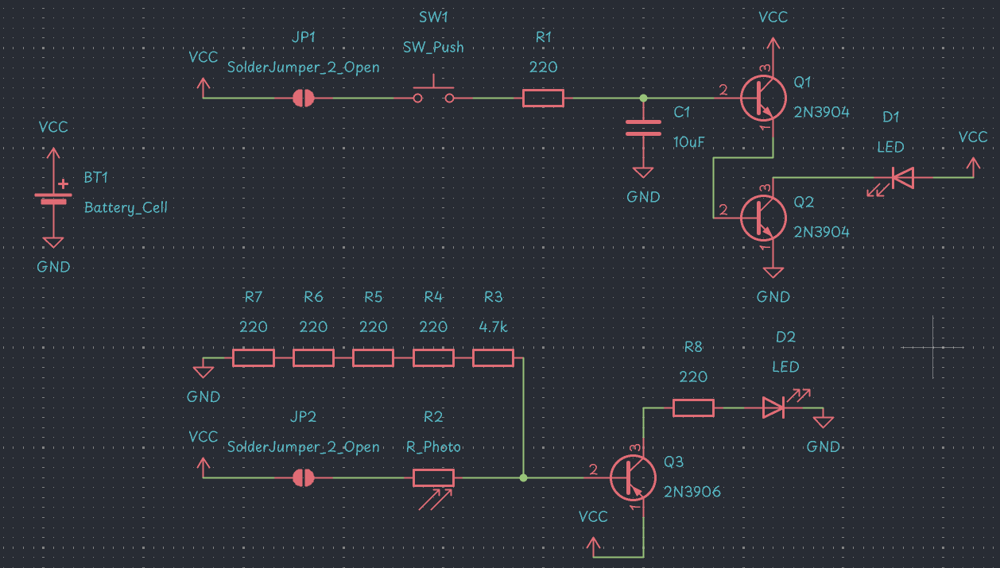
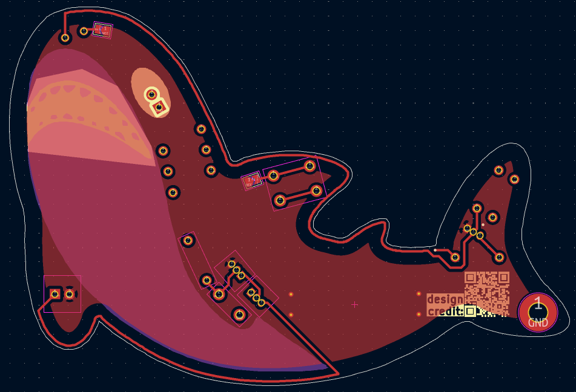
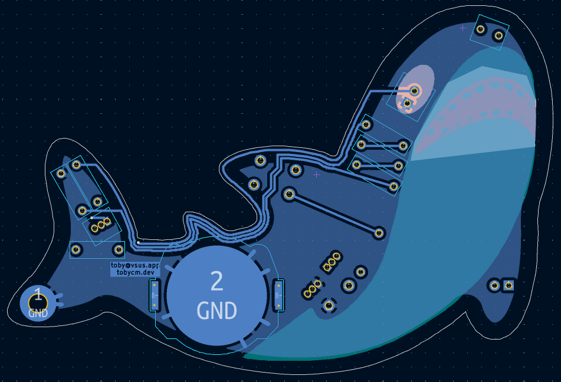
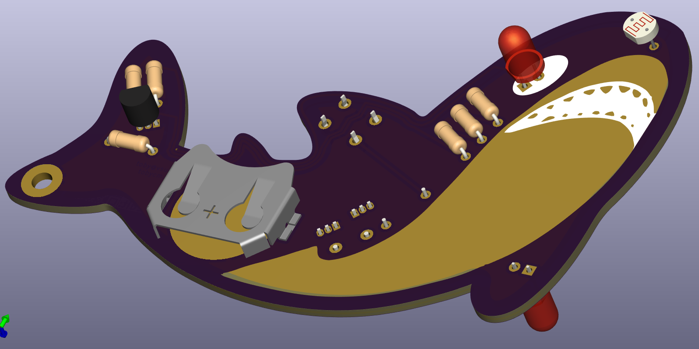

# Blahaj Keychain

with glow-in-the-dark eye, purrfect for presents :3

## Schematic

## PCB

## Features
- stay-on LED after pressing the button
- glow-in-the-dark eye
- shiny body
- very cute

## BOM

| Part           | Value   | Quantity |
|:---------------|:--------|---------:|
| Resistor       | 4.7k    |        1 |
| Resistor       | 220     |        6 |
| Photoresistor  |         |        1 |
| LED            |         |        2 |
| Capacitor      | 10uF    |        1 |
| 2N3904         |         |        2 |
| 2N3906         |         |        1 |
| Battery Holder |         |        1 |
| Button         |         |        1 |

made by the one and only [@tobycm](https://github.com/tobycm) :3 rawrrrr

readme ~~copied~~ inspired from [https://github.com/cheyao/Open555](https://github.com/cheyao/Open555)

design ur own pcb at [https://solder.hackclub.com](https://solder.hackclub.com)
